# viz

## Лабораторная работа 1

### Задание 1
```python
name = (input("Имя: "))
age = int(input("Возраст: "))
print (f"Привет, {name}! Через год тебе будет {age+1}.")
```
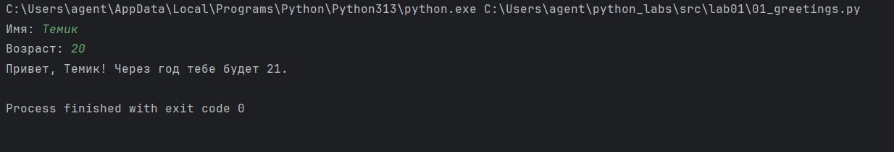# python_labs

### Задание 2
```python
a = float(input("a: "))
b = float(input("b: "))
sum = a + b
average = sum /2
print (f"sum - {round(sum, 2)}; average - {round(average, 2)}")
```
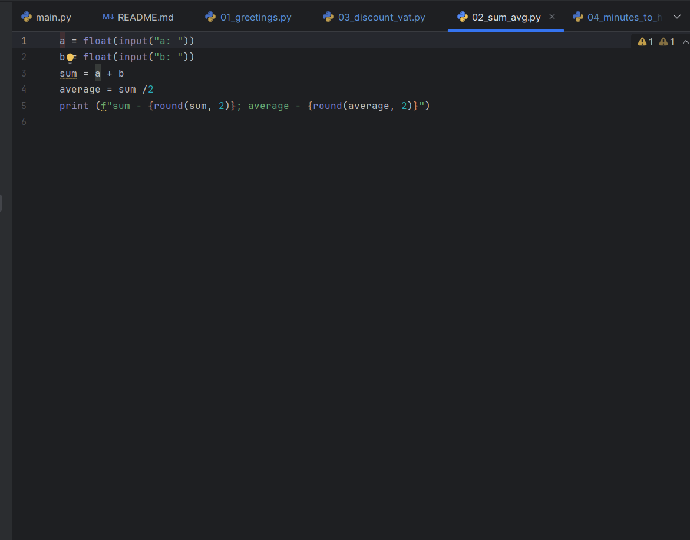# python_labs

### Задание 3
```python
price = float(input("Price: "))
discount = float(input("Discount: "))
vat = float(input("VAT: "))
base = price * (1 - discount/100)
vat_amount = base * (vat/100)
total = base + vat_amount
print (f"База после скидки: {base:.2f} ₽\n"
       f"НДС: {vat_amount:.2f} ₽\n"
       f"Итого к оплате: {total:.2f} ₽\n")
```
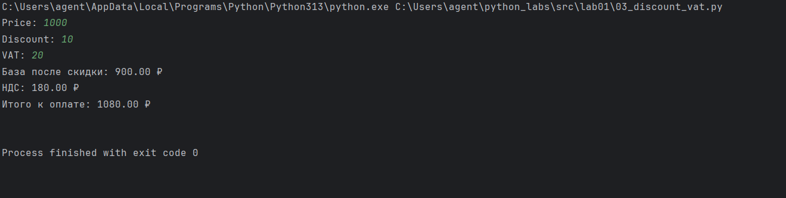# python_labs

### Задание 4
```python
m = int(input("Целые минуты: "))
hour = m // 60
min = m % 60
print (f"{hour}:{min:02d}")
```
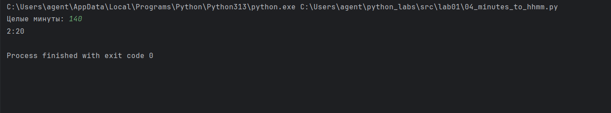# python_labs

### Задание 5
```python
FIO = input("ФИО: ")
FIO = ' '.join(FIO.split())
splitwords = FIO.split()
FIO_2 = FIO.strip()
fletters = []
str_fletters = '' 
for word in splitwords:
    fletters.append(word[0].upper())
for letter in fletters:
    str_fletters += letter
print(f"Инициалы: {str_fletters}")
print(f"Длина (символов): {len(FIO_2)}")
```
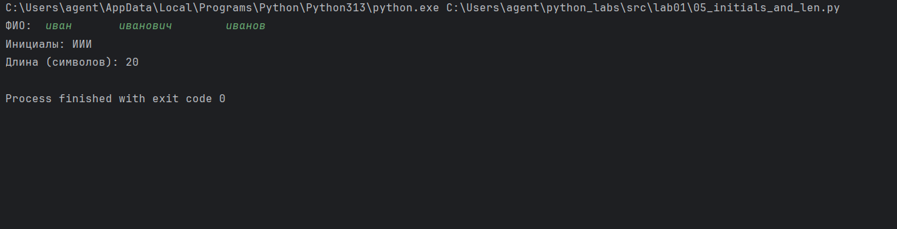# python_labs


## Лабораторная работа 2

### Задание 1
```python
def min_max(nums: list[float | int]) -> tuple[float | int, float | int]:    
    if not nums:    
        raise ValueError("Список пуст")    
    return (min(nums),max(nums))    
    
def unique_sorted(nums: list[float | int]) -> list[float | int]:     
    return sorted(set(nums)) if nums else []       

def flatten(mat: list[list | tuple]) -> list:   
    if not mat: 
        raise ValueError("Список пуст")   

    result = []
    for row in mat:
        if not isinstance(row,(list,tuple)): 
            raise TypeError("строка не строка строк матрицы")  
        result.extend(row)  
    return result 
    


def show_min_max(x):
    try:
        print(x, "→", min_max(x))
    except ValueError:
        print(x, "→ ValueError")

def show_unique_sorted(x):
    print(x, "→", unique_sorted(x))

def show_flatten(x):
    try:
        print(x, "→", flatten(x))
    except TypeError:
        print(x, "→ TypeError")


show_min_max([1337, -1, 6, 5, 0])
show_min_max([428])
show_min_max([-5, -29, -9])
show_min_max([])
show_min_max([1.55, 2, 2.1, -3.9])

print()

show_unique_sorted([1337, 2, 4, 2, 1337])
show_unique_sorted([])
show_unique_sorted([-2, -2, 0, 3, 3])
show_unique_sorted([1.0, 1, 2.5, 2.5, 0])

print()

show_flatten([[1, 2], [8, 9]])
show_flatten([[1], [23, 73], (43, 53)])
show_flatten([[1], [6, 5], [1]])
show_flatten([[1, 2], "strcmp"])
```
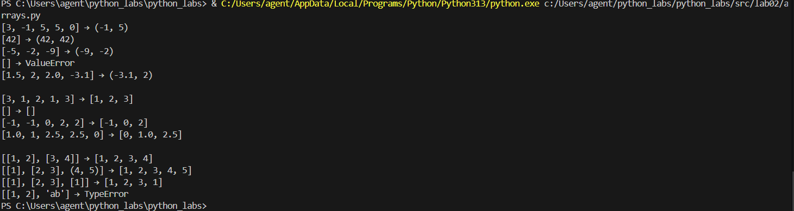# python_labs

### Задание 2
```python
def transpose(mat: list[list[int | float]]) -> list[list[int | float]]:
    if not mat:
        return []
    
    for i in range(len(mat) - 1):
        if len(mat[i]) != len(mat[i + 1]):
            raise ValueError("Матрица рваная")

    result = []
    for i in range(len(mat[0])):
        new_list = []
        for k in range(len(mat)):
            new_list.append(mat[k][i])  
        result.append(new_list)         
    return result 


def row_sums(mat: list[list[int | float]]) -> list[float]:
    if not mat:
        return []
    for i in range(len(mat) - 1):
        if len(mat[i]) != len(mat[i + 1]):  
            raise ValueError("Матрица рваная")
    result = []
    for row in mat:
        s = 0.0
        for x in row:
            s += x
        result.append(s)
    return result


def col_sums(mat: list[list[int | float]]) -> list[float]:
    if not mat:
        return []
    for i in range(len(mat) - 1):
        if len(mat[i]) != len(mat[i + 1]):
            raise ValueError("Матрица рваная")
    rows = len(mat)        
    cols = len(mat[0]) 
    result = [0.0] * cols
    for j in range(cols):
        s = 0.0
        for i in range(rows):
            s += mat[i][j]
        result[j] = s
    return result


def show_transpose(m):
    try:
        print(f"{str(m):<25} → {transpose(m)}")
    except ValueError:
        print(f"{str(m):<25} → ValueError")

def show_row_sums(m):
    try:
        print(f"{str(m):<25} → {row_sums(m)}")
    except ValueError:
        print(f"{str(m):<25} → ValueError")

def show_col_sums(m):
    try:
        print(f"{str(m):<25} → {col_sums(m)}")
    except ValueError:
        print(f"{str(m):<25} → ValueError")

show_transpose([[11, 12, 13], [41, 52, 63]])   
show_transpose([[-3, 3], [7, -7]])    
show_transpose([[0, 0], [0, 0]]) 
show_transpose([[1, 2], [3]])  
print()
show_row_sums([[1, 12, 23], [44, 65, 86]])   
show_row_sums([[-1, 5], [2, -10]])    
show_row_sums([[1, 1], [1, 1]]) 
show_row_sums([[1, 2], [3]])  
print()
show_col_sums([[1, 99, 366], [42, 52, 61]])   
show_col_sums([[-1, 4], [8, -10]])    
show_col_sums([[0, 0], [0, 0]]) 
show_col_sums([[1, 2], [5]])    
```
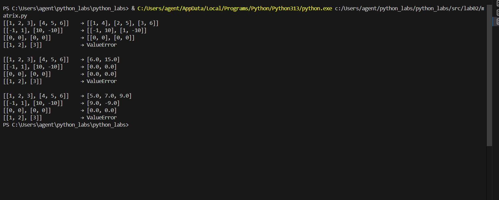# python_labs

### Задание 3
```python
def format_record(rec: tuple[str, str, float]) -> str:
    fio, group, gpa = rec
    parts = fio.split()
    if len(parts) < 2:
        raise ValueError("Некорректное ФИО")
    surname = parts[0].capitalize()
    initial = "".join(w[0].upper()+"." for w in parts [1:3])
    group1 = " ".join(group.split()).upper()
    if not group1:
        raise ValueError("Группа не должна быть пустой")
    if not isinstance(gpa,(int,float)):
        raise TypeError("GPA должен быть числом")
    gpa_str = f"{float(gpa):.2f}"

    return f"{surname} {initial}, гр. {group1}, GPA {gpa_str}"

print(format_record(("Иванов Иван Иванович", "BVIT-25", 4.6)))
print(format_record(("Петров Пётр", "ИКВО-12", 5.0)))
print(format_record(("Петров Пётр Петрович", "ИКВО-12", 5.0)))
print(format_record(("  сидорова   анна  сергеевна ", "ABB-01", 3.999)))
print(format_record((" ", "BVIT-25", 4.6)))
```
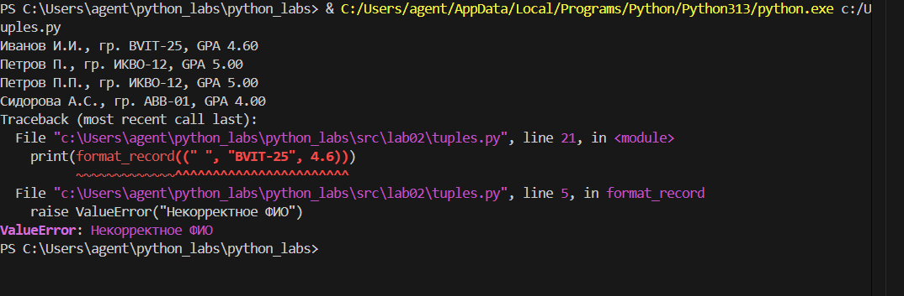# python_labs

## Лабораторная работа 3

### Задание А
```
import re

def normalize(text: str, *, casefold: bool = True, yo2e: bool = True) -> str:
    s=text
    if casefold :
        s=s.casefold()
    if yo2e :
        s=s.replace("ё","е").replace("Ё","Е")
    s=s.replace("\t"," ").replace("\r"," ").replace("\n"," ")
    s = ' '.join(s.split())
    s=s.strip()

    return s

def tokenize(text: str) -> list[str]:
    pattern= r'\w+(?:-\w+)*'
    tokenstext = re.findall(pattern, text)

    return tokenstext

def count_freq(tokens: list[str]) -> dict[str, int]:
    counts={}
    for word in tokens:
        counts[word]=counts.get(word,0)+1
    return counts

def sort_key(item):
    return [-item[1], item[0]]

def top_n(freq: dict[str, int], n: int = 5) -> list[tuple[str, int]]:
    sorted_freq= sorted(freq.items(),key=sort_key)
    top_n=[]

    for i in range(min(n, len(sorted_freq))):
        top_n.append((sorted_freq[i][0], sorted_freq[i][1]))

    return top_n

def summary(text):
    normalized_text = normalize(text)

    tokens = tokenize(normalized_text)

    total_words = len(tokens)
    freq_sorted = count_freq(tokens)
    unique_words = len(freq_sorted)
    top = top_n(freq_sorted, 5)

    print(f"Всего слов: {total_words}")
    print(f"Уникальных слов: {unique_words}")
    print("Топ-5:")

    for word, count in top:
        print(f"{word}:{count}")
```
Отдельный тестовый файл с тест-кейсами
```
import sys
import os

project_root = os.path.abspath(os.path.join(os.path.dirname(__file__), '..', '..'))
sys.path.insert(0, project_root)

from src.lib.text import *

print(normalize("ПрИвЕт\nМИр\t"))
print(normalize("ёжик, Ёлка", yo2e=True))
print(normalize("Hello\r\nWorld"))
print(normalize("  двойные   пробелы  "))


print(tokenize("привет мир"))
print(tokenize("hello,world!!!"))
print(tokenize("по-настоящему круто"))
print(tokenize("2025 год"))
print(tokenize("emoji 😀 не слово"))

print(top_n(count_freq(["a", "b", "a", "c", "b", "a"]), n=2))
print(top_n(count_freq(["bb", "aa", "bb", "aa", "cc"]), n=2))
```
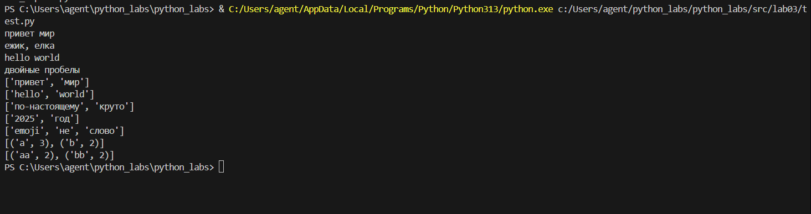# python_labs
### Задание B
```
import sys
import os
sys.path.insert(0, os.path.abspath(os.path.join(os.path.dirname(__file__), '..', '..')))
from src.lib.text import normalize, tokenize, count_freq, top_n

def main():
    input_text = sys.stdin.readline()


    text_norm = normalize(input_text)
    tokens = tokenize(text_norm)
    freq = count_freq(tokens)

    words_total = len(tokens)
    unique_words = len(freq)

    top_words = top_n(freq, 5)

    print(f"Всего слов: {words_total}")
    print(f"Уникальных слов: {unique_words}")
    print("Топ-5:")
    for word, count in top_words:
        print(f"{word}:{count}")

if __name__ == "__main__":
    main()
```
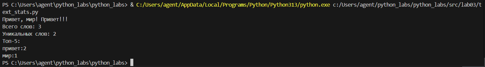# python_labs

## Лабораторная работа 4

### Задание A
```
from pathlib import Path
from typing import Iterable, Sequence
import csv

# Ридинг
def read_text(path: str, encoding: str = "utf-8") -> str:
    p = Path(path)
    try:
        return p.read_text(encoding=encoding) 
    except UnicodeDecodeError:
        print("Ошибка кодировки.")
        exit(1)  

# Врайтинг
def write_csv(rows: Iterable[Sequence], path: str | Path, header: list[str] = None) -> None:
    p = Path(path)
    with p.open("w", newline="", encoding="utf-8") as f: 
        writer = csv.writer(f)
        if header:
            writer.writerow(header)  
        writer.writerows(rows)  
```
### Задание B
```
import csv
import re
from pathlib import Path
from collections import Counter

# Ридинг
def read_text(path: str) -> str:
    p = Path(path)
    try:
        with p.open("r", encoding="utf-8") as f:
            return f.read()
    except FileNotFoundError:
        print(f"Файл {path} не найден.")
        return ""

# Приведение в нижний регистр
def normalize(text: str) -> str:
    return text.lower().replace("\n", " ").replace("\r", " ")

# Разделение на слова
def tokenize(text: str) -> list[str]:
    WORD_RE = re.compile(r"\b\w+\b")  # Регулярное выражение для поиска слов
    return WORD_RE.findall(text)

# Подсчет частоты
def count_freq(tokens: list[str]) -> dict[str, int]:
    return dict(Counter(tokens))

# Сортировка по частоте
def sorted_word_counts(freq: dict[str, int]) -> list[tuple[str, int]]:
    return sorted(freq.items(), key=lambda item: item[1], reverse=True)

# Функции записи в csv 
def write_csv(rows: list[list[str]], path: str, header=None):
    with open(path, mode="w", encoding="utf-8", newline="") as f:
        writer = csv.writer(f)
        if header:
            writer.writerow(header)
        writer.writerows(rows)

# Все вместе
def process_and_write_text():
    text = read_text("src/data/lab04/input.txt")
    normalized_text = normalize(text)
    tokens = tokenize(normalized_text)
    freq = count_freq(tokens)
    sorted_freq = sorted_word_counts(freq)


    # Запись в csv
    write_csv(sorted_freq, "src/data/lab04/report.csv", header=["word", "count"])

# Запуск
if __name__ == "__main__":
    process_and_write_text()
```
![Картинка 1][./images/lab04/text_report.png]# python_labs


## Лабораторная работа 5

### Тестовые данные (people.json)
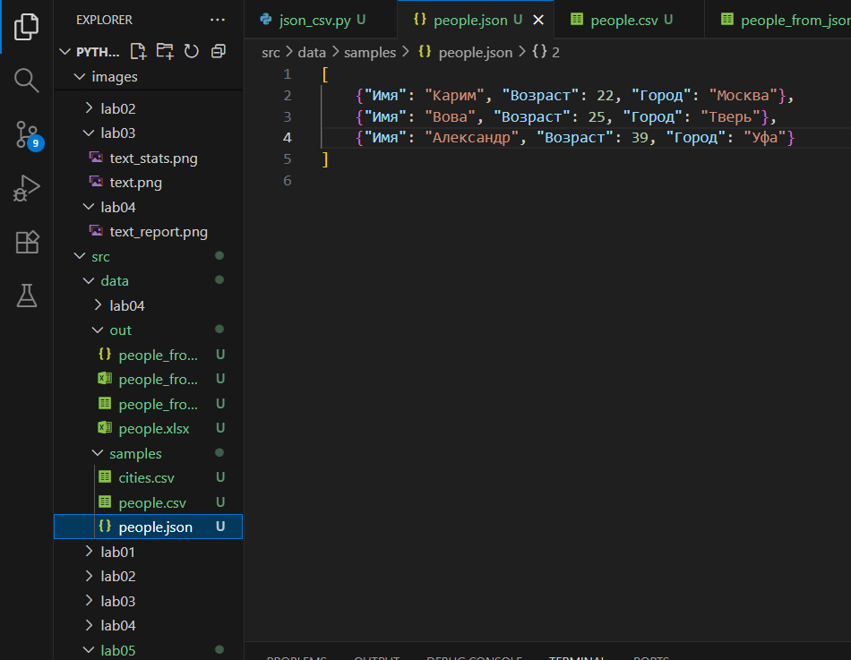# python_labs

### Задание A
```
import json
import csv
from pathlib import Path

def json_to_csv(json_path: str, csv_path: str) -> None:
    json_file = Path(json_path)
    csv_file = Path(csv_path)

    if json_file.suffix != '.json':
        raise ValueError(f"Неверный тип файла: {json_path}. Ожидается .json")
    
    if not json_file.exists():
        raise FileNotFoundError(f"JSON файл не найден: {json_path}")
# Ридинг из json
    with open(json_path, 'r', encoding='utf-8') as f:
        data = json.load(f)
    
    if not data:
        raise ValueError(f"Пустой JSON файл: {json_path}")

# Врайтинг в csv
    with open(csv_path, 'w', newline='', encoding='utf-8') as f:
        if data:
            writer = csv.DictWriter(f, fieldnames=data[0].keys())
            writer.writeheader()
            writer.writerows(data)
        else:
            raise ValueError(f"Пустой JSON файл: {json_path}")
        
    print(f"Файл успешно преобразован в CSV: {csv_path}")

# Пути к файлам
json_file_path = 'src/data/samples/people.json' 
csv_file_path = 'src/data/out/people_from_json.csv'  

json_to_csv(json_file_path, csv_file_path)
```
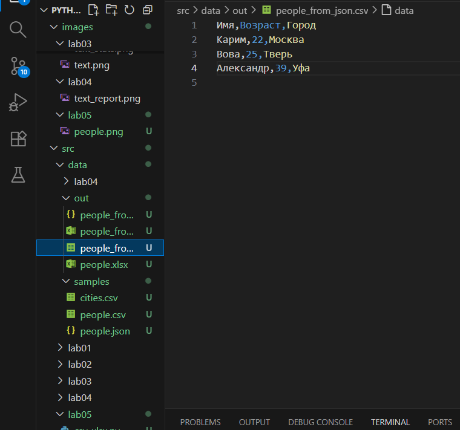# python_labs


### Задание B
```
import csv
from pathlib import Path

def csv_to_xlsx(csv_path: str, xlsx_path: str) -> None:
    csv_file = Path(csv_path)
    xlsx_file = Path(xlsx_path)

    if csv_file.suffix != '.csv':
        raise ValueError(f"Неверный тип файла: {csv_path}. Ожидается .csv")
    
    if not csv_file.exists():
        raise FileNotFoundError(f"CSV файл не найден: {csv_path}")
# Ридинг из csv
    with open(csv_path, 'r', encoding='utf-8') as f:
        reader = csv.reader(f)
        rows = list(reader)

    if not rows:
        raise ValueError(f"Пустой CSV файл: {csv_path}")
# Врайтинг в xlsx
    with open(xlsx_path, 'w', newline='', encoding='utf-8') as f:
        writer = csv.writer(f)
        writer.writerows(rows)
    
    print(f"Файл успешно преобразован в XLSX: {xlsx_path}")

# Пути к файлам
csv_file_path = 'src/data/out/people_from_json.csv'  
xlsx_file_path = 'src/data/out/people_from_csv.xlsx'  

csv_to_xlsx(csv_file_path, xlsx_file_path)
```
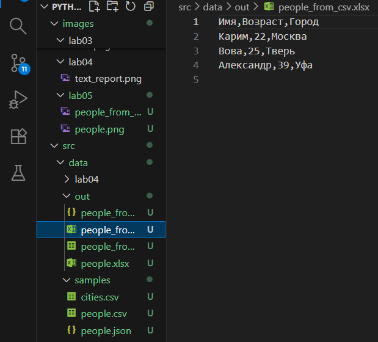# python_labs

## Лабораторная работа 6

### Задание 1
```
import argparse
import re
from collections import Counter

# Функция для вывода содержимого файла
def cat(input_file, number_lines=False):
    try:
        with open(input_file, 'r', encoding='utf-8') as file:
            for idx, line in enumerate(file, 1):
                if number_lines:
                    print(f"{idx}: {line.strip()}")
                else:
                    print(line.strip())
    except FileNotFoundError:
        print(f"Ошибка: файл {input_file} не найден.")

# Функция для анализа частоты слов
def stats(input_file, top=5):
    try:
        with open(input_file, 'r', encoding='utf-8') as file:
            text = file.read().lower()
            words = re.findall(r'\w+', text)
            word_counts = Counter(words)
            most_common = word_counts.most_common(top)
            print(f"Топ {top} самых часто встречающихся слов:")
            for word, count in most_common:
                print(f"{word}: {count}")
    except FileNotFoundError:
        print(f"Ошибка: файл {input_file} не найден.")

def main():
    parser = argparse.ArgumentParser(description="CLI утилиты для работы с текстовыми файлами")
    subparsers = parser.add_subparsers(dest="command")

    # Подкоманда cat — для вывода содержимого файла
    cat_parser = subparsers.add_parser("cat", help="Вывести содержимое файла")
    cat_parser.add_argument("--input", required=True, help="Путь к файлу")
    cat_parser.add_argument("-n", action="store_true", help="Нумеровать строки")

    # Подкоманда stats — для анализа частоты слов
    stats_parser = subparsers.add_parser("stats", help="Анализ частотности слов")
    stats_parser.add_argument("--input", required=True, help="Путь к файлу")
    stats_parser.add_argument("--top", type=int, default=5, help="Количество часто встречающихся слов")

    args = parser.parse_args()

    if args.command == "cat":
        cat(args.input, args.n)
    elif args.command == "stats":
        stats(args.input, args.top)

if __name__ == "__main__":
    main()
```
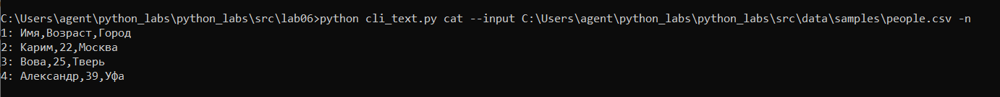# python_labs
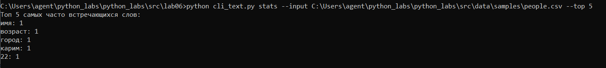# python_labs

### Задание 2
```
import argparse
import json
import csv

# Конвертация JSON в CSV
def json2csv(input_file, output_file):
    try:
        with open(input_file, 'r', encoding='utf-8') as json_file:
            data = json.load(json_file)
        
        with open(output_file, 'w', newline='', encoding='utf-8') as csv_file:
            writer = csv.writer(csv_file)
            # Записываем заголовки (из ключей первого словаря)
            writer.writerow(data[0].keys())
            # Записываем данные
            for entry in data:
                writer.writerow(entry.values())
        print(f"Конвертация из JSON в CSV завершена: {output_file}")
    except FileNotFoundError:
        print(f"Ошибка: файл {input_file} не найден.")

# Конвертация CSV в JSON
def csv2json(input_file, output_file):
    try:
        with open(input_file, 'r', encoding='utf-8') as csv_file:
            reader = csv.reader(csv_file)
            headers = next(reader)  # Заголовки (первый ряд)
            rows = [dict(zip(headers, row)) for row in reader]
        
        with open(output_file, 'w', encoding='utf-8') as json_file:
            json.dump(rows, json_file, indent=4)
        print(f"Конвертация из CSV в JSON завершена: {output_file}")
    except FileNotFoundError:
        print(f"Ошибка: файл {input_file} не найден.")

def main():
    parser = argparse.ArgumentParser(description="Конвертеры данных")
    subparsers = parser.add_subparsers(dest="cmd")

    # Подкоманда json2csv — конвертация из JSON в CSV
    json2csv_parser = subparsers.add_parser("json2csv", help="Конвертировать JSON в CSV")
    json2csv_parser.add_argument("--in", dest="input", required=True, help="Путь к файлу JSON")
    json2csv_parser.add_argument("--out", dest="output", required=True, help="Путь к файлу CSV")

    # Подкоманда csv2json — конвертация из CSV в JSON
    csv2json_parser = subparsers.add_parser("csv2json", help="Конвертировать CSV в JSON")
    csv2json_parser.add_argument("--in", dest="input", required=True, help="Путь к файлу CSV")
    csv2json_parser.add_argument("--out", dest="output", required=True, help="Путь к файлу JSON")

    args = parser.parse_args()

    if args.cmd == "json2csv":
        json2csv(args.input, args.output)
    elif args.cmd == "csv2json":
        csv2json(args.input, args.output)

if __name__ == "__main__":
    main()
```
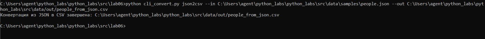# python_labs
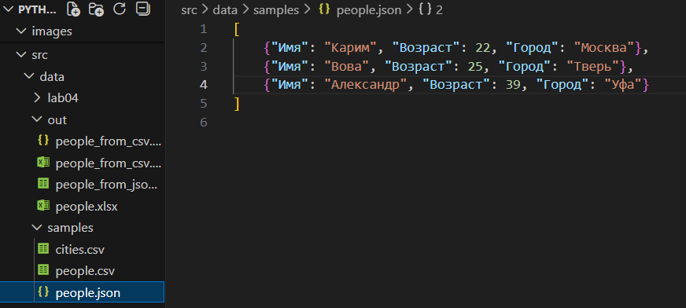# python_labs
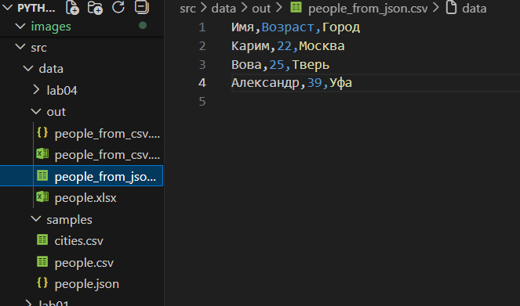# python_labs
